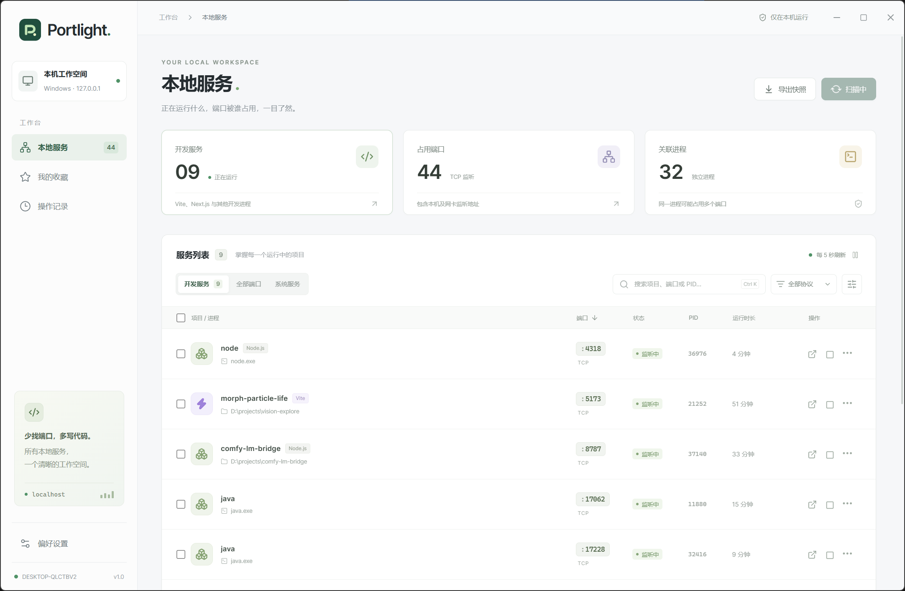

# Portlight

一个给 Windows 开发者用的本地端口管理桌面应用。查看正在运行的项目、定位端口占用，打开页面或项目目录，并结束不再需要的进程。localhost 开太多，至少能知道谁还没下班。

**当前仅支持 Windows 10 / 11，打包目标为 Windows x64。** 扫描和结束进程依赖 Windows PowerShell；macOS、Linux 暂不支持。



## 能做什么

- 扫描 TCP 监听端口，可在设置中显示 UDP 绑定；支持 IPv4 / IPv6，合并同一进程的重复地址绑定。
- 根据进程与父进程的启动命令推断项目目录，读取 `package.json` 展示项目名称，识别常见开发框架与运行时。
- 按项目、端口、PID、路径、协议和监听地址搜索，按名称、端口或启动时间排序。
- 切换开发服务 / 全部端口 / 系统服务，收藏常用服务；设置与收藏保存在本机。
- 打开浏览器或项目目录，复制端口、地址和启动命令；在详情侧栏查看进程、内存和运行时间。
- 单个或批量结束进程，操作前确认影响范围，可选包含子进程。
- 自动刷新、暂停、紧凑列表、会话操作记录与 JSON 快照导出。
- `Ctrl+K` 聚焦搜索，`Esc` 关闭弹窗或详情。

## 直接使用

仓库只包含源码，`release/` 中的构建产物不纳入 Git。首次使用可按下方步骤从源码运行，或执行 `pnpm dist` 自行生成便携版。

生成后，双击 `release/Portlight-<版本号>-win-x64.exe` 即可运行，无需在使用这台 EXE 的电脑上安装 Node.js 或 pnpm。第一次启动会先解压运行时，稍等片刻即可。

执行 `pnpm pack` 后也可以运行 `release/win-unpacked/Portlight.exe`；移动这个版本时需要保留整个 `win-unpacked` 目录。

默认使用普通用户权限。查看部分受保护进程的信息、结束以管理员身份启动的开发服务时，可能需要以管理员身份运行。应用始终禁止结束 Windows 核心进程、自身进程，以及无法核实身份的进程。

## 开发

在 Windows 上准备 Node.js 22.12+ 和 pnpm 10（项目锁定的包管理器版本为 `10.15.1`）。

```powershell
git clone git@github.com:Canlendula/portlight.git
cd portlight
pnpm install
pnpm dev
```

`pnpm dev` 同时启动 Vite 和 Electron，界面热更新。开发服务从 `127.0.0.1:47831` 开始选择空闲端口；退出桌面窗口时会关闭开发服务器。修改 Electron 主进程或 PowerShell 脚本后重新启动开发命令。

```powershell
pnpm build       # 类型检查、前端和 Electron 构建
pnpm start       # 运行已构建的桌面应用
pnpm pack        # 生成 release/win-unpacked
pnpm dist        # 生成 Windows x64 便携 EXE
pnpm dev:web     # 只预览界面，明确标识为示例数据
```

`pnpm dev:web` 的示例模式不会扫描或结束真实进程。便携版中的桌面应用直接通过隔离的 IPC 调用本机功能，不会启动管理用 HTTP 服务，也不会上传进程信息。

框架识别目前覆盖 Vite、Next.js、Nuxt、Astro、Webpack、FastAPI、Django、Flask，以及 Node.js、Python、Bun、Deno、.NET 等运行时。识别结果来自命令行推断，部分启动方式可能只显示进程名。

## 扫描与结束进程

主进程调用系统 PowerShell 的 `Get-NetTCPConnection`、`Get-NetUDPEndpoint` 和 `Win32_Process`。网络接口不可用时退回 `netstat -ano`；元数据读取受限时退回 `Get-Process` 并显示提示。

结束操作会重新扫描，核对 PID、启动时间和端口归属。PowerShell 持有目标进程句柄后再次核对启动时间，以防 PID 重用误杀。只结束指定 PID，勾选子进程后才进一步遍历并核实子进程身份；不会结束父终端。

一次结束会释放该 PID 的所有端口。进程树是在执行时枚举的；快速创建新子进程的程序仍可能有残留，刷新列表即可确认。受进程管理器自动拉起的服务也可能重新出现。

## 边界

- 端口表示 TCP 正在监听或 UDP 已绑定，不包括普通 TCP 已建立连接。
- 网页地址由监听地址与命令参数推断，未主动向所有端口发 HTTP 请求。数据库等非 HTTP 服务不能作为网页打开。
- 相对启动命令、全局 CLI、权限受限的进程未必能准确识别项目目录，此时展示进程名。
- WSL / Docker 内部进程和项目名称不保证可见；只展示 Windows 主机暴露的端口。
- 收藏关联项目路径（无法识别时使用进程名）、协议和端口。离线收藏保留，在相同端口上线后再次显示。
- 操作记录只保留当前会话最近 80 条。自动变动记录排除系统服务，并遵循 UDP 显示设置。
- JSON 快照包含路径和启动命令，可能涉及项目中的敏感信息；分享前自行检查。
- 当前打包配置不对 EXE 签名。

## 验证

```powershell
pnpm test        # 端口解析、项目识别、保护规则、地址合并等单元测试
pnpm test:live   # Windows 集成测试，仅使用脚本自己创建的临时进程
```

集成测试验证真实 TCP/UDP 扫描、启动时间身份校验、旧身份拒绝、同 PID 多端口释放、无关测试进程保持运行，以及可选的子进程结束。异常时会向仍存活的测试进程发送退出消息。

## 目录

```text
electron/         Electron 主进程、preload、扫描与结束逻辑
src/              React 界面、样式、浏览器示例数据
shared/           IPC 与服务数据类型
scripts/          开发启动、构建、图标和 Windows 集成验证
tests/            核心逻辑单元测试
public/           应用图标
release/          本地构建产物（不纳入版本控制）
build/            打包使用的图标资源
```

技术栈：Electron、React、TypeScript、Vite、Lucide，使用 pnpm 管理依赖。界面使用系统字体，不依赖外部字体或图片服务。

## 许可证

[MIT](LICENSE)，Copyright © 2026 Canlendula。
